# Automated Chess Coaching & Cloud Data Pipeline

A personal project built on Google Cloud Platform that does two things:

1. **Automatically analyzes my chess games** after I play them and sends AI coaching feedback to my Discord server
2. **Builds a data pipeline** from Chess.com into BigQuery to track my performance over time, visualize trends, and predict game outcomes using machine learning

---

## Architecture

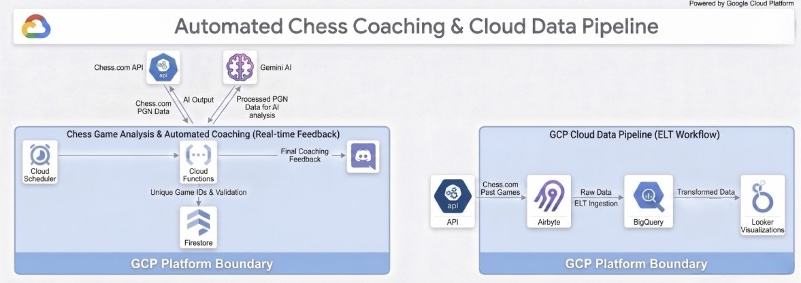

---

## Part 1 — Automated Chess Coach

Every 2 minutes, a scheduled job checks if I've played a new chess game. If I have, it:

1. Fetches the game from Chess.com's public API
2. Sends the moves to Gemini AI for analysis
3. Posts a detailed coaching report to my Discord server
4. Stores the game's unique ID in Firestore so the same game is never analyzed twice

### What the feedback looks like

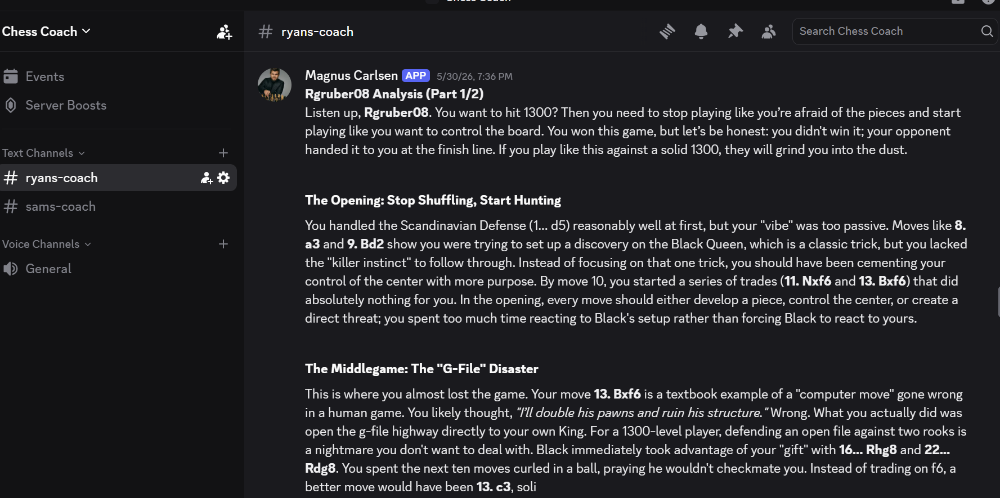
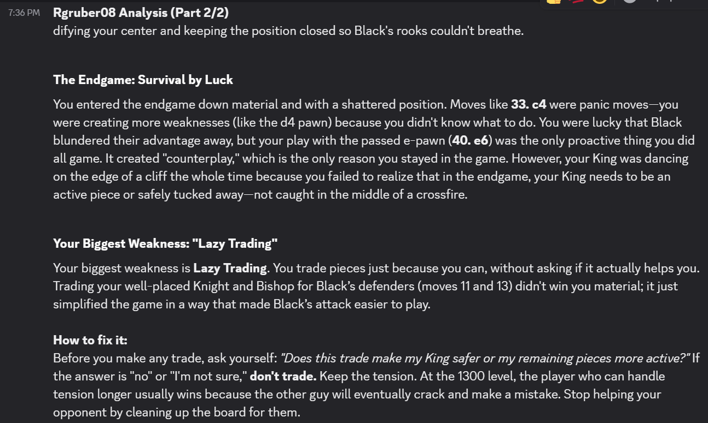

The coach is intentionally blunt — it breaks down the opening, middlegame, and endgame separately, identifies the biggest mistake in each phase, and explains specifically what to do differently next time.

### How it's built

| Component | Role |
|-----------|------|
| Cloud Scheduler | Triggers the pipeline every 2 minutes via HTTP |
| Cloud Run | Hosts the Python function that runs everything |
| Chess.com API | Provides the game data |
| Gemini AI | Analyzes the moves and writes the coaching report |
| Firestore | Tracks which games have already been processed |
| Discord Webhook | Delivers the final report |

```python
# Core logic — fetch the latest game, analyze it, send to Discord
game_data = get_latest_chess_game(username)
if not already_analyzed(game_data['uuid']):
    feedback = get_agentic_feedback(game_data['pgn'], username)
    send_to_discord(feedback, webhook_url, username)
```

---

## Part 2 — Data Pipeline (ELT Workflow)

Beyond real-time coaching, I wanted to analyze my performance across hundreds of games over time. This part of the project pulls my full game history from Chess.com into BigQuery, transforms it into a clean analysis table, and runs visualizations and machine learning on top of it.

### Step 1 — Ingestion (Airbyte)

I built a **custom Airbyte connector** using Connector Builder that hits Chess.com's archive API and loads my game history month by month into BigQuery — one table per month.

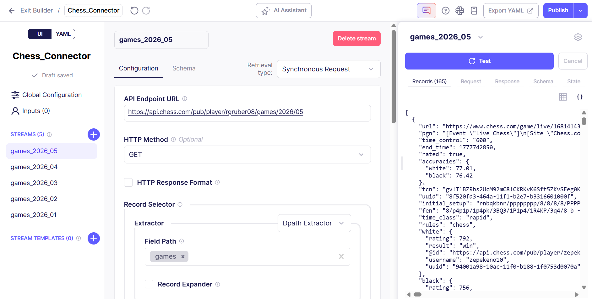

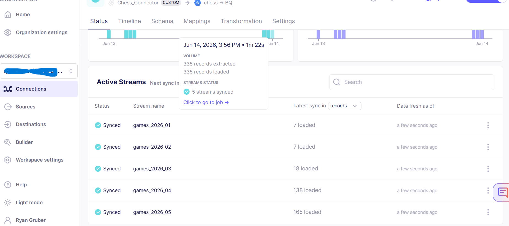

335 games across 5 months, all synced and deduplicated using each game's unique ID as the primary key.

### Step 2 — Transformation (BigQuery SQL)

The raw data landed as 5 separate monthly tables with nested JSON columns. I consolidated everything into one clean analysis table (`games_all`) using a multi-stage SQL query that:

- Combines all 5 months into one dataset
- Extracts nested JSON fields (player names, ratings, accuracy scores) into clean typed columns
- Adds player-perspective columns (`my_rating`, `my_result`, `opponent`) so every analysis is already oriented around my performance rather than an arbitrary white/black perspective

```sql
-- Reorienting every column around "my" perspective
CASE WHEN white_user = 'Rgruber08' THEN white_rating ELSE black_rating END AS my_rating,
CASE WHEN white_user = 'Rgruber08' THEN black_user  ELSE white_user  END AS opponent,
CASE WHEN white_user = 'Rgruber08' THEN white_result ELSE black_result END AS my_result_raw
```

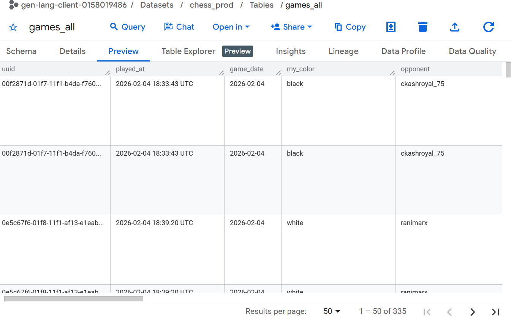

### Step 3 — Cost Optimization (Partitioning & Clustering)

The final table is **partitioned by month** on `game_date` and **clustered by `my_result`, `time_class`, and `eco`**. This means queries that filter by date range or game type only scan the relevant slice of data rather than the whole table — an important pattern for keeping BigQuery costs down at scale.

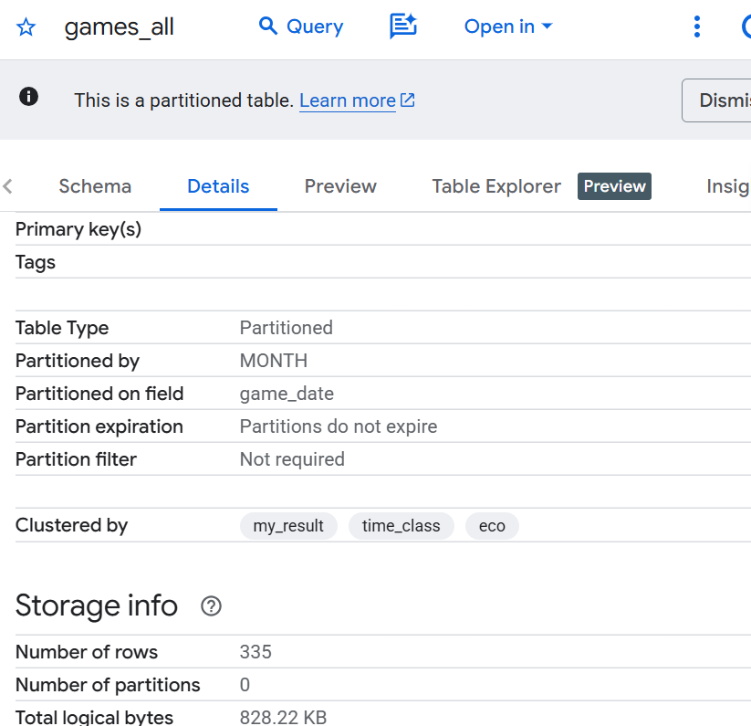

---

## Visualizations

### Rating Over Time

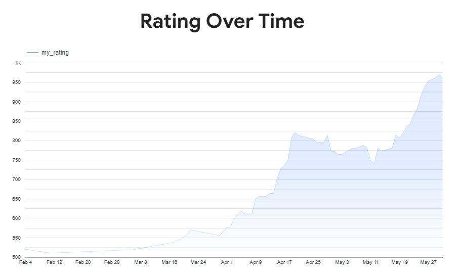

My rating climbed from ~490 in February to ~960 by the end of May — nearly doubling in 4 months.

### Win / Loss / Draw Breakdown

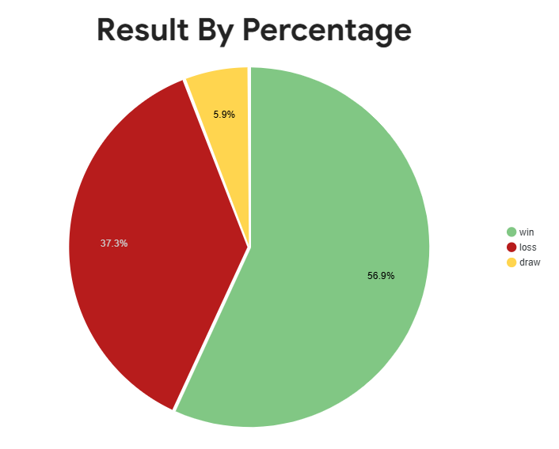

56.9% win rate across 335 rated games.

### Does Accuracy Actually Predict Wins?

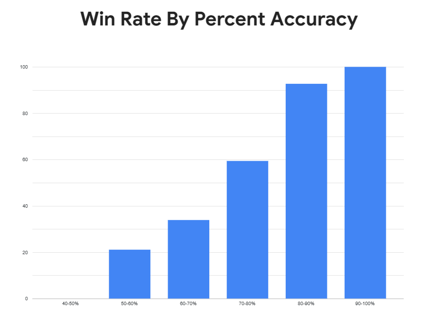

Yes — and the relationship is almost perfectly linear. At 40–50% accuracy the win rate is near 0%. At 90–100% it's 100%. This confirms that playing more accurately is the single most impactful thing I can do to win more games, which is obvious in theory but satisfying to prove in my own data.

---

## Machine Learning (BigQuery ML)

I trained a logistic regression model directly in BigQuery to predict whether I'd win a game, based on:

- My rating going into the game
- My opponent's rating
- The opening played (ECO code)
- The time control
- Whether I played white or black

### Model Performance

| Metric | Score |
|--------|-------|
| Accuracy | 83.6% |
| ROC AUC | 0.926 |
| Precision | 83.3% |
| Recall | 89.7% |

An ROC AUC of 0.926 is strong — 0.5 would mean the model is guessing randomly, and 1.0 would be perfect prediction. The performance is largely driven by the rating difference between me and my opponent, which is a well-established predictor in chess.

### Key Finding — Opponent Rating Matters More Than Mine

My opponent's rating had roughly **4x more influence** on the outcome than my own rating. This makes intuitive sense: by the time I'm in a game, my rating already reflects my historical strength. The real variable is who I'm sitting across from.

### Opening Analysis

The model also identified which openings are associated with wins and losses specifically in my games:

**Openings most associated with wins:**

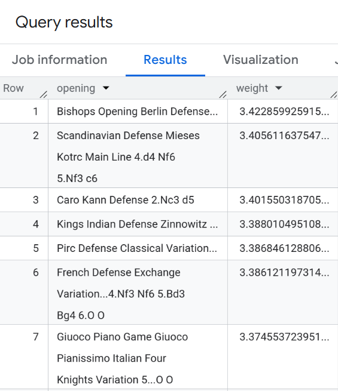

**Openings most associated with losses:**

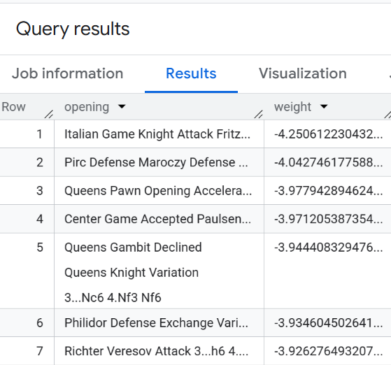

Interestingly, the Italian Game (Giuoco Piano) — which I would have called my best opening — ranked 7th. The model suggests my results in it are partly explained by playing it against weaker opponents, rather than the opening itself being inherently strong for me. That said, with small sample sizes per opening variation, these rankings are directional rather than definitive.

---

## Tech Stack

| Tool | Purpose |
|------|---------|
| Python | Cloud Run coaching function |
| Google Cloud Run | Serverless hosting for the coaching pipeline |
| Google Cloud Scheduler | Triggers the pipeline every 2 minutes |
| Google Firestore | Tracks already-analyzed games |
| Gemini AI | Game analysis and coaching output |
| Chess.com API | Source of game data |
| Airbyte (Connector Builder) | Custom ELT connector into BigQuery |
| Google BigQuery | Data warehouse, SQL transformation, ML |
| BigQuery ML | Logistic regression win predictor |
| Looker Studio | Dashboards and visualizations |
